<h1 align="center" > PROJETO <b style="color: #03A9F5;">BLUE BANK</b> </h1>

<h3> :loudspeaker: O que é o projeto? </h3>
<p>O projeto <b>Blue Bank</b> é uma API REST de um banco fictício desenvolvido em Java com framework Spring e serviços da AWS Cloud. O Blue Bank é a entrega do desafio final do treinamento de <b>Java e AWS</b> fornecido pela <b>Gama Academy</b> e pelo <b>Banco PAN</b>.</p>
<a target="_blank" href="./assets/files/desafio-final-pan.pdf"> 🔗 Acesse aqui o pdf com a descrição completa do desafio.</a>

<hr>

<h3>:handshake: Equipe : <b style="color: #03A9F5;">L.A.J.Y.M</b></h3>
<table>
    <tr>
        <th><b>L.</b></th>
        <th><b>A.</b></th>
        <th><b>J.</b></th>
        <th><b>Y.</b></th>
        <th><b>M.</b></th>
    </tr>
    <tr>
        <th>Lucas</th>
        <th>Ayanara</th>
        <th>João</th>
        <th>Yuri</th>
        <th>Maxwel</th>
    </tr>
    <tr>
        <td align="center">
            <a href="https://www.linkedin.com/in/ayanara/">
                
            </a>
        </td>
        <td align="center">
            <a href="https://www.linkedin.com/in/joaovictorschiavon/">
                
            </a>
        </td>
        <td align="center">
            <a href="https://www.linkedin.com/in/lucas-guimar%C3%A3es-rocha/">
                
            </a>
        </td>
        <td align="center">
            <a href="https://www.linkedin.com/in/maxwelfcoelho/">
                
            </a>
        </td>
        <td align="center">
            <a href="https://www.linkedin.com/in/yuri-campos/">
                
            </a>
        </td>
    </tr>
</table>

<hr>

<h3 id="sumario"> 📑 Sumário </h3>

- <a href="#requisitos"> Requisitos para rodar o projeto.</a>
    - <a href="#requisitos-com-docker"> Com Docker.</a>
    - <a href="#requisitos-sem-docker"> Sem Docker.</a>
- <a href="#como-rodar">Como rodar o projeto.</a>
    - <a href="#rodar-com-docker"> Com Docker.</a>
    - <a href="#rodar-sem-docker"> Sem Docker.</a>
- <a href="#db"> Banco de dados.</a>
  - <a href="#dtr">DTR do banco de dados.</a>
  - <a href="./db/db_bancoblue.sql"> 🔗 Script SQL para inicializar o banco.</a>
  - <a href="./db/script_inserir_dados.sql"> 🔗 Script SQL para popular o banco.</a>
- <a href="#tecnologias">Tecnologias e recursos utilizadas no projeto.</a>
- <a href="#recursos">Requisitos e funcionalidades.</a>
    - <a href="#recursos-obrigatorios"> Obrigatórios da entrega.</a>
    - <a href="#recursos-extras">Extras.</a>
- <a href="#endpoints">Endpoints da API.</a>
- <a href="#swagger">Swagger UI.</a>
- <a href="#diretorios">Diretórios de arquivos do projeto.</a>

<hr>

<h3 id="requisitos"> 🧾 Requisitos para rodar o projeto</h3>

<h4 id="requisitos-com-docker"> Com Docker:</h4> 

- <a target="_blank" href="https://maven.apache.org/">Maven</a>
- <a target="_blank" href="https://openjdk.java.net/install/">Java 11</a>
- <a target="_blank" href="https://docs.docker.com/engine/install/">Docker</a>
- <a target="_blank" href="https://docs.docker.com/compose/install/">Docker Compose</a>

<h4 id="requisitos-sem-docker"> Sem Docker:</h4>

- <a target="_blank" href="https://maven.apache.org/">Maven</a>
- <a target="_blank" href="https://openjdk.java.net/install/">Java 11</a>
- <a target="_blank" href="https://www.mysql.com/downloads/">MySql</a>

<hr>

<h3 id="como-rodar"> 🏗️ Rodar o projeto</h3>

<h4 id="rodar-com-docker"> Com Docker:</h4> 

- Gere o <b>.jar</b> da aplicação executando o comando no terminal:
    ```shell
    mvn clean install -Dskiptests
    ```

- Instancie e rode os containers executando o comando no terminal:
    ```shell
    docker-compose up --build --force-recreate
    ```

<h4 id="rodar-sem-docker"> Sem Docker:</h4> 

- Gere o <b>.jar</b> da aplicação executando o comando no terminal:
    ```shell
    mvn clean install -Dskiptests
    ```

- Para rodar o <b>.jar</b> vá até a pasta do projeto pelo terminal e rode o comando:
    ```shell
    java -jar -Dspring.profiles.active=localdebug blue-bank-0.0.1-SNAPSHOT.jar
     ```

- Para setar diretamente no Intellij o <b>profile de configurações do application.properties</b>:
  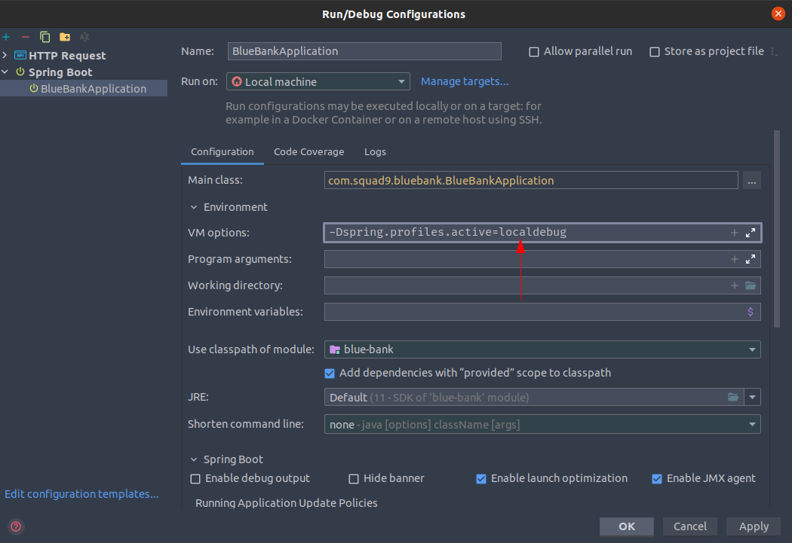

  <b>OBS: O profile de application.properties default está com as configurações para rodar utilizando os containers que
  são levantados no docker-compose.</b>

<hr>

<h3 id="db"> :wastebasket: Banco de Dados</h3>

- <h4 id="dtr">DTR do banco de dados: </h4>
  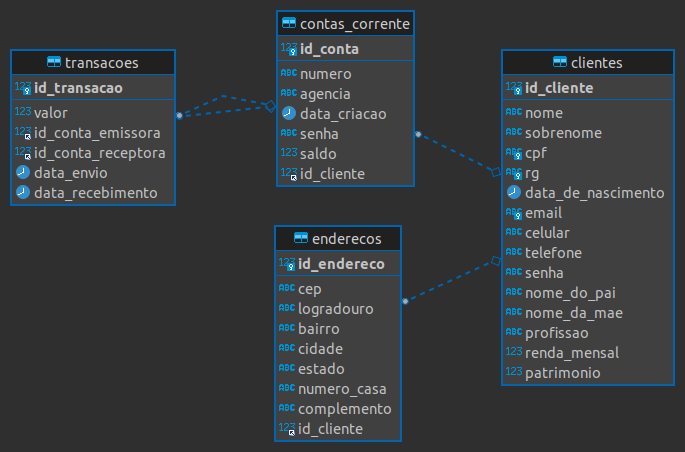

<hr>

<h3 id="tecnologias"> 🚀 Tecnologias e recursos utilizadas no projeto</h3>

- Jira (Kanban)
- Java
- Banco de Dados MySQL
- Docker
- Spring Web
- Spring Security
- Token JWT
- Hibernate Validator
- Swagger v2
- Spring Cloud AWS
- Spring Cloud AWS Messaging (SNS)
- JUnit (Testes unitários)

<hr>

<h3 id="recursos"> :boom: Requisitos e funcionalidades</h3>

- <h4 id="recursos-obrigatorios"> Obrigatórios da entrega:</h4>

    - Planejamento (Metodologias Ágeis):
        - [X] Kanban com todas as tarefas organizadas e responsáveis definidos.
    - Projeto (Backend):
        - [X] Cadastro de clientes.
        - [X] Listagem de clientes.
        - [X] Atualização de clientes.
        - [X] Deletar clientes.
        - [X] Histórico de transações entre contas.
    - Banco de Dados:
        - [X] Tabelas bem estruturadas e populadas com valores para testes.
        - [X] O banco deve ser entregue em script SQL junto ao repositório.
    - Gerais:
        - [X] O código deve ser entregue em um repositório no Github.
        - [X] A API deve ser disponibilizada em ambiente AWS com EC2 e em Beanstalk.
        - [X] A aplicação deve ter um pipeline em Jenkins ou no <b>Aws Build (Foi implementado pelo AWS Build)</b>.
        - [X] A aplicação precisa ser configurada no API Gateway da AWS.
        - [X] A aplicação precisa ter no mínimo um endpoint de SNS para cadastro de emails e verificação automática.
        - [X] A aplicação precisa ter no mínimo um Lambda.
        - [X] Liste os endpoints no README.md
        - [X] O Banco deve ser entregue em script SQL junto ao repositório.

- <h4 id="recursos-extras">Extras:</h4>

    - Planejamento (Metodologias Ágeis):
        - [X] Criação do backlog com tarefas referentes ao desenvolvimento.
        - [X] Criação do icebox com tarefas extras propostas para implementações futuras.
        - [X] Detalhamento descritivo das tarefas da squad dentro dos seus cards.
        - [X] Formatação Kanban no padrão: <b>icebox, backlog, to do, doing e done</b>.
        - [X] Definição de data de entrega das tarefas nos cards.
        - [X] Definição de responsável pelo card.
        - [X] Priorização dos cards através de tags de relevância.
        - [X] Associação dos cards com os <b>Épicos</b> abaixo para definição de uma data de entrega de cada etapa do
          projeto.
            - Preparar inicio do projeto
            - Backend
            - Configurar servidor AWS
            - Documentação
            - Banco de dados
            - Apresentação
    - Projeto (Backend):
        - [X] Implementação do Spring Security e Token JWT para autenticação de acesso a endpoints que o cliente precisa
          estar logado para ter acesso.
        - [X] Implementação de validações de todos campos nos Models e nos DTOs de request utilizando Regex e anotações
          do Hibernate Validator.
        - [X] Implementação do Swagger v2 para documentação da API e listagem de endpoints.
        - [X] Implementação do <b>docker-compose.yaml</b> e <b>Dockerfile</b> para rodar o banco de dados e a API.
        - [X] Configuração de diferentes <b>profiles de application.properties</b> com variáveis de ambiente para subir
          o projeto localmente, via Docker, no EC2 (AWS) ou no Beanstalk (AWS).
        - [X] Implementação de testes unitários com JUnit.
    - Banco de Dados:
        - [X] Diagrama de DTR do banco de dados.

<hr>

<h3 id="endpoints"> :boom: Endpoints da API</h3>

<table>
  <tr>
    <th>URL</th>
    <th>Verbo HTTP</th>
    <th>Dados</th>
  </tr>
<tr></tr>
  <tr>
    <td colspan="3" align="center">  :arrow_right_hook: Realizar login de um cliente </td>
  </tr>
  <tr>
    <td rowspan="2">
      /api/clientes/login
    </td>
    <td rowspan="2">
      POST
    </td>
    <td>
<pre>
Header
{
  "Content-Type" : "application/json"
}
</pre>
    </td>
  </tr>
  <tr>
    <td>
<pre>
Body
{
  "email" : "string",
  "senha" : "string"
}
</pre>
    </td>
  </tr>
<tr></tr>
  <tr>
    <td colspan="3" align="center">  :arrow_right_hook: Realizar cadastro de um novo cliente </td>
  </tr>
  <tr>
    <td rowspan="2">
      /api/clientes
    </td>
    <td rowspan="2">
      POST
    </td>
    <td>
<pre>
Header
{
  "Content-Type" : "application/json"
}
</pre>
    </td>
  </tr>
  <tr>
    <td>
<pre>
Body
{
  "celular": "string",
  "cpf": "string",
  "dataDeNascimento": "2021-12-04T19:12:19.373Z",
  "email": "string",
  "nome": "string",
  "nomeDaMae": "string",
  "nomeDoPai": "string",
  "patrimonio": 0,
  "profissao": "string",
  "rendaMensal": 0,
  "rg": "string",
  "senha": "string",
  "sobrenome": "string",
  "telefone": "string"
}
</pre>
    </td>
  </tr>
<tr></tr>
  <tr>
    <td colspan="3" align="center">  :arrow_right_hook: Consultar dados de um cliente </td>
  </tr>
  <tr>
    <td rowspan="2">
      /api/clientes/{idCliente}
    </td>
    <td rowspan="2">
      GET
    </td>
    <td>
<pre>
Header
{
  "Content-Type" : "application/json",
  "Authorization" : "Bearer {clienteToken}"
}
</pre>
    </td>
  </tr>
  <tr>
    <td>
<pre>
Body
{
  "Content-Type" : "application/json",
  "Authorization" : "Bearer {clienteToken}"
}
</pre>
    </td>
  </tr>
<tr></tr>
</table>


<hr>

## Acessar documentação [SWAGGER]

- Se estiver rodando localmente, acesse:
    ```
        http://localhost:8080/swagger-ui.html
    ```
- Se estiver rodando em algum servidor, acesse:
    ```
        <BASE_URL>/swagger-ui.html
    ```

## Subindo a API no AWS EC2

- <b> 1º - Criando a máquina virtual no EC2: </b>Siga os passos a passos indicados nas imagens após logar na sua conta na AWS.
    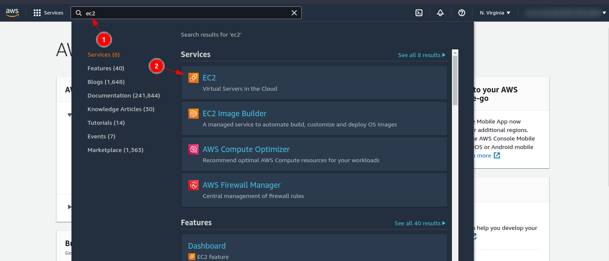

    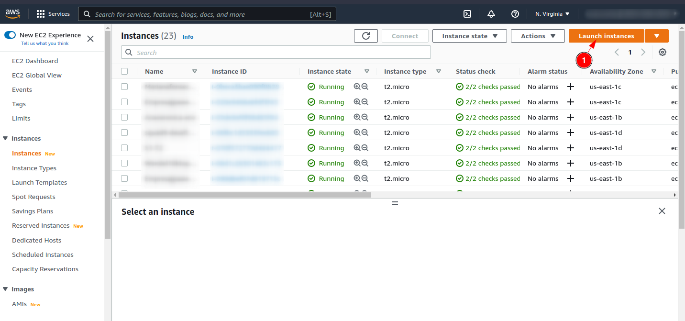

    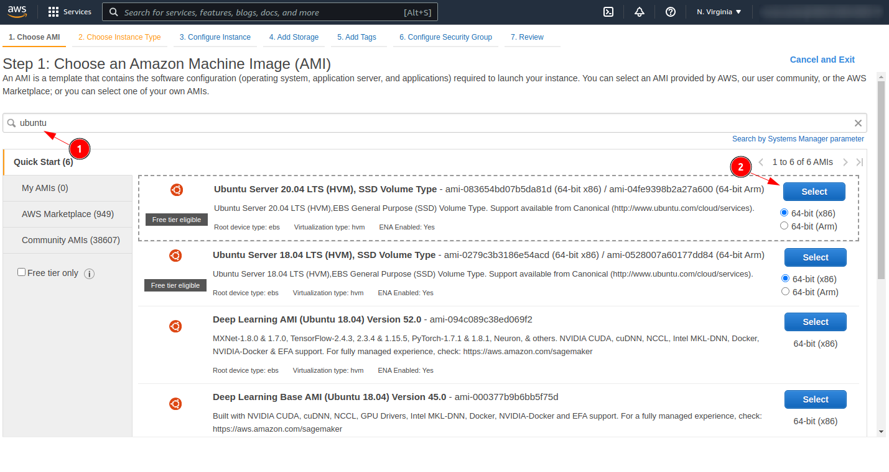

    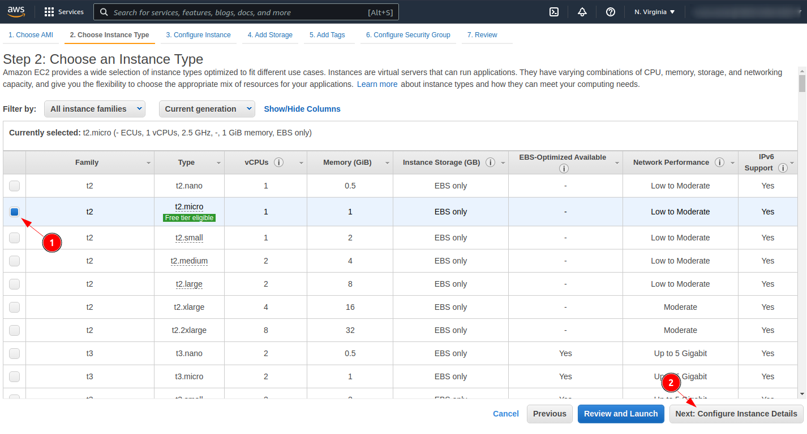

    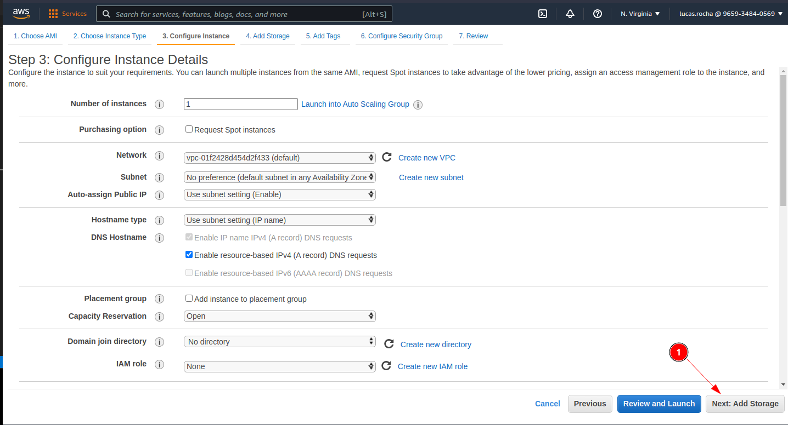

    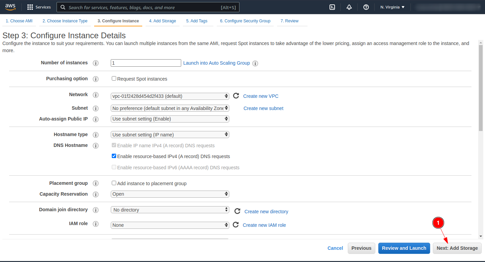

    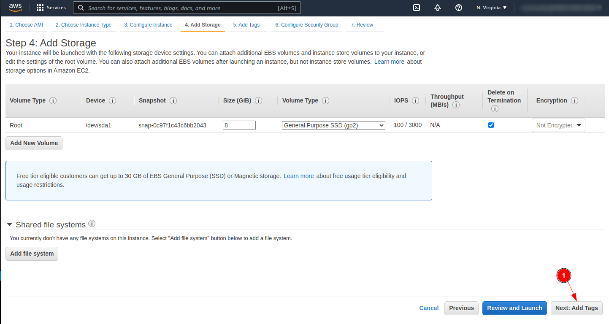

    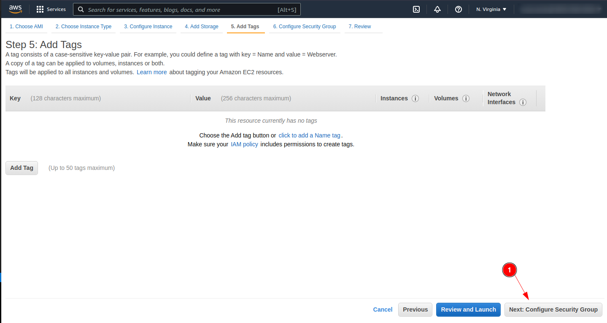

    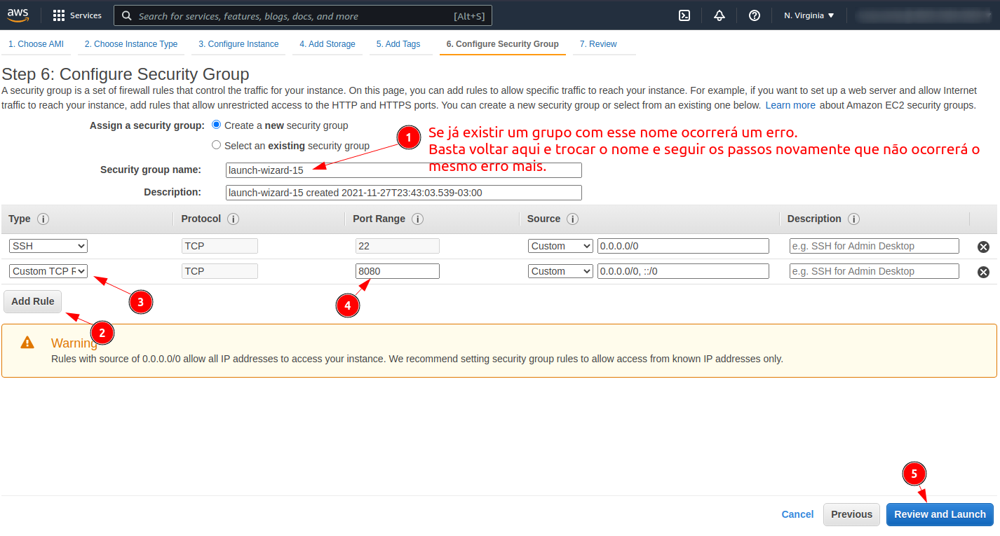

    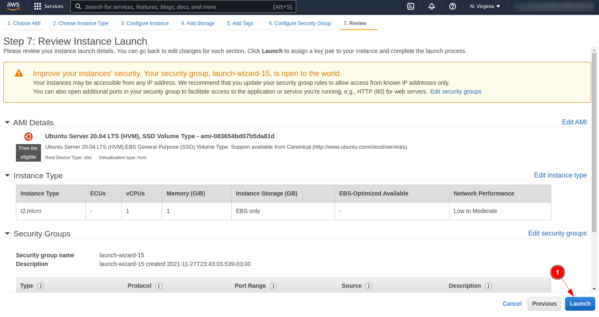

    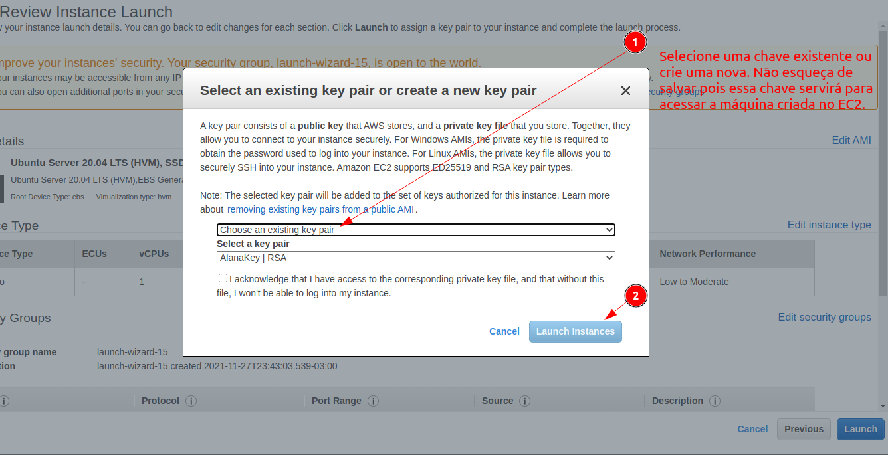

    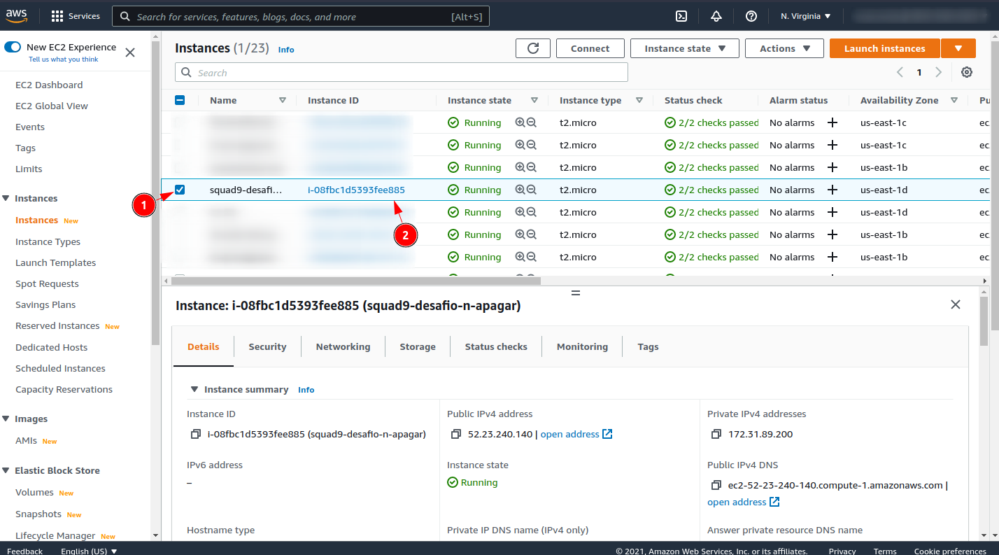

    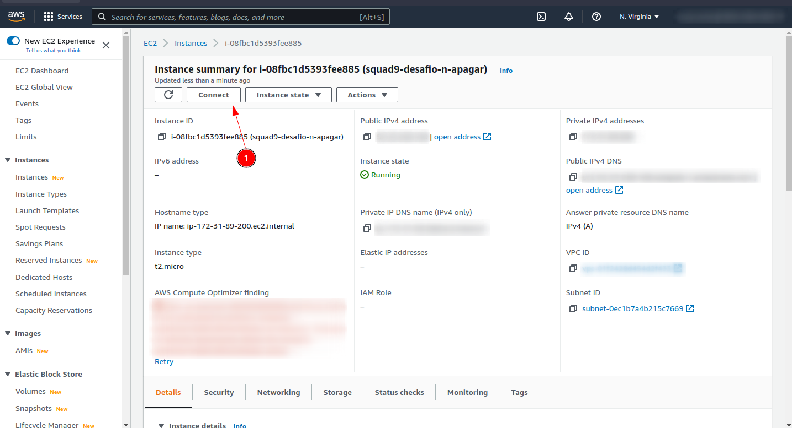

- <b> 2º - Configurando a máquina: </b>Agora, com a sua máquina Ubuntu já lançada e rodando iremos conectar via SSH para configurar o Ubuntu e deixá-lo pronto para executar uma aplicação Java Spring com Mysql. Para isso utilizaremos as informações disponibilizadas na aba SSH client.

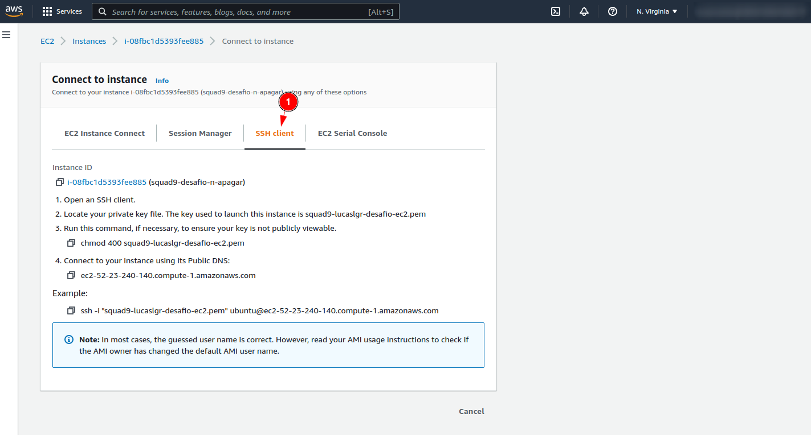

    - Torne o arquivo .pem da sua chave que você fez download um arquivo executável com o comando:
        ```
        chmod 400 aws-sua-chave.pem
        ```
    - Conecte-se no servidor Ubuntu criado via SSH utilizando o comando:
        ```
        ssh -i aws-sua-chave.pem ubuntu@ec2-52-23-240-140.compute-1.amazonaws.com
        ```
    - Instale o JAVA e o MySql:
        ```
        sudo apt-get update
        sudo apt-get install default-jdk mysql-server --yes
        ```

- <b> 3º - Gerando, subindo a aplicação para a máquina Ubuntu e rodando: </b> .
    - Verifique o username e password do MySql com o comando:
        ```
        sudo cat /etc/mysql/debian.cnf
        ```
        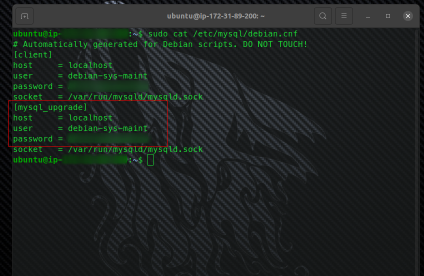

    - Exporte o username e o password como variaveis de ambiente na sua instancia de Ubuntu na AWS:
        ```
        export AWS_EC2_MYSQL_USERNAME=usarname
        export AWS_EC2_MYSQL_PASSWORD=password
        ```

    - Localmente na sua máquina configure um novo profile de application-<b>awsec2</b>.properties da aplicação Spring
      conforme a imagem abaixo.
      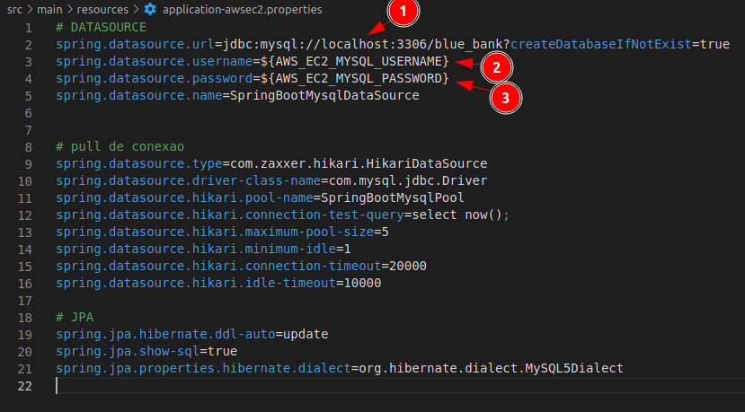

    - Localmente na sua máquina gere o arquivo .jar da aplicação:
        ```
        mvn clean install -Dskiptests 
        ```

    - Copie o arquivo .jar gerado na sua máquina local para a máquina Ubuntu remota na AWS:
        ```
        scp -i aws-sua-chave.pem ~/projects/blue-bank-squad9/target/blue-bank-0.0.1-SNAPSHOT.jar ubuntu@ec2-52-23-240-140.compute-1.amazonaws.com:~
        ```
    - Após terminar o upload rode o arquivo .jar do seu projeto diretamente pela sua instância do ubuntu via ssh setando
      o profile de application.properties correto:
        ```
        java -jar -Dspring.profiles.active=awsec2 blue-bank-0.0.1-SNAPSHOT.jar
        ```