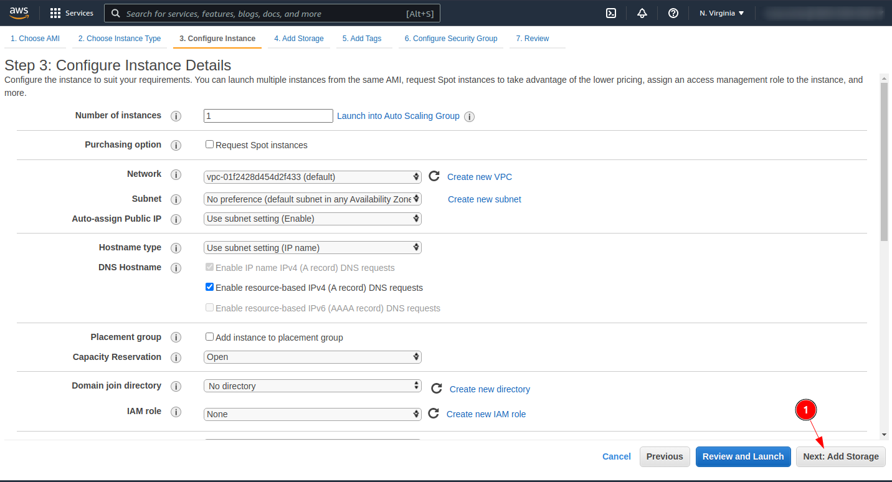
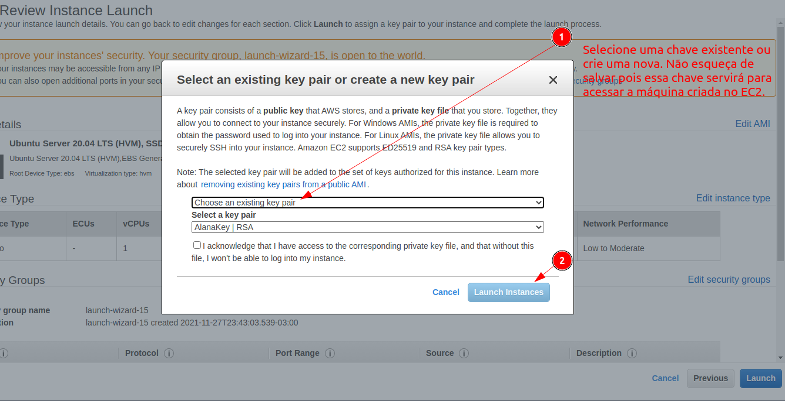
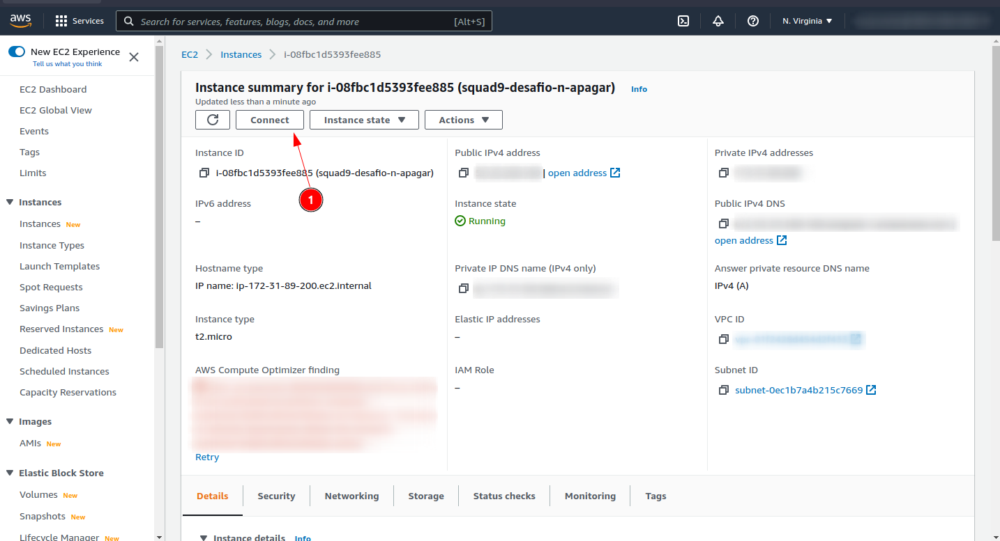
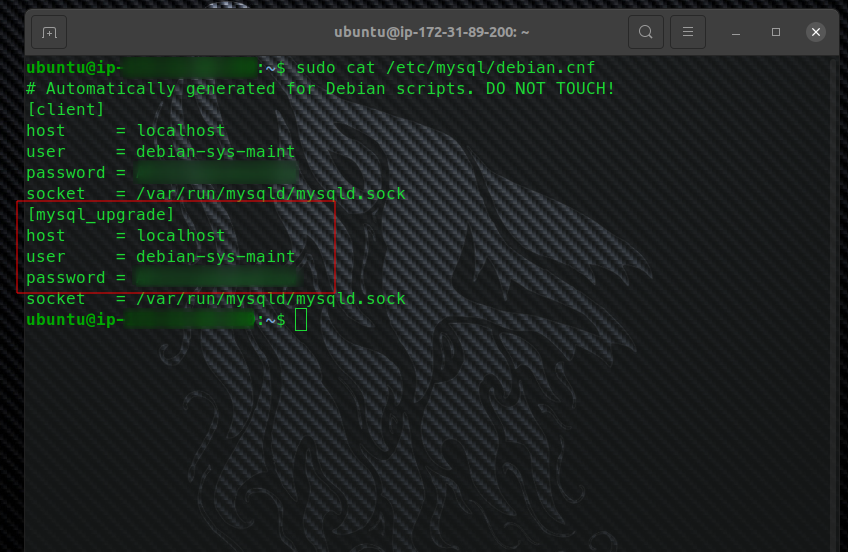

## Subindo a API no AWS EC2

- <b> 1º - Criando a máquina virtual no EC2: </b>Siga os passos a passos indicados nas imagens após logar na sua conta na AWS.
    

    

    

    

    

    

    

    

    

    

    

    

- <b> 2º - Configurando a máquina: </b>Agora, com a sua máquina Ubuntu já lançada e rodando iremos conectar via SSH para configurar o Ubuntu e deixá-lo pronto para executar uma aplicação Java Spring com Mysql. Para isso utilizaremos as informações disponibilizadas na aba SSH client.


    - Torne o arquivo .pem da sua chave que você fez download um arquivo executável com o comando:
        ```
        chmod 400 aws-sua-chave.pem
        ```
    - Conecte-se no servidor Ubuntu criado via SSH utilizando o comando:
        ```
        ssh -i aws-sua-chave.pem ubuntu@ec2-52-23-240-140.compute-1.amazonaws.com
        ```
    - Instale o JAVA e o MySql:
        ```
        sudo apt-get update
        sudo apt-get install default-jdk mysql-server --yes
        ```

- <b> 3º - Gerando, subindo a aplicação para a máquina Ubuntu e rodando: </b> .
    - Verifique o username e password do MySql com o comando:
        ```
        sudo cat /etc/mysql/debian.cnf
        ```
        

    - Exporte o username e o password como variaveis de ambiente na sua instancia de Ubuntu na AWS:
        ```
        export AWS_EC2_MYSQL_USERNAME=usarname
        export AWS_EC2_MYSQL_PASSWORD=password
        ```

    - Localmente na sua máquina configure um novo profile de application-<b>awsec2</b>.properties da aplicação Spring
      conforme a imagem abaixo.
      

    - Localmente na sua máquina gere o arquivo .jar da aplicação:
        ```
        mvn clean install -Dskiptests 
        ```

    - Copie o arquivo .jar gerado na sua máquina local para a máquina Ubuntu remota na AWS:
        ```
        scp -i aws-sua-chave.pem ~/projects/blue-bank-squad9/target/blue-bank-0.0.1-SNAPSHOT.jar ubuntu@ec2-52-23-240-140.compute-1.amazonaws.com:~
        ```
    - Após terminar o upload rode o arquivo .jar do seu projeto diretamente pela sua instância do ubuntu via ssh setando
      o profile de application.properties correto:
        ```
        java -jar -Dspring.profiles.active=awsec2 blue-bank-0.0.1-SNAPSHOT.jar
        ```