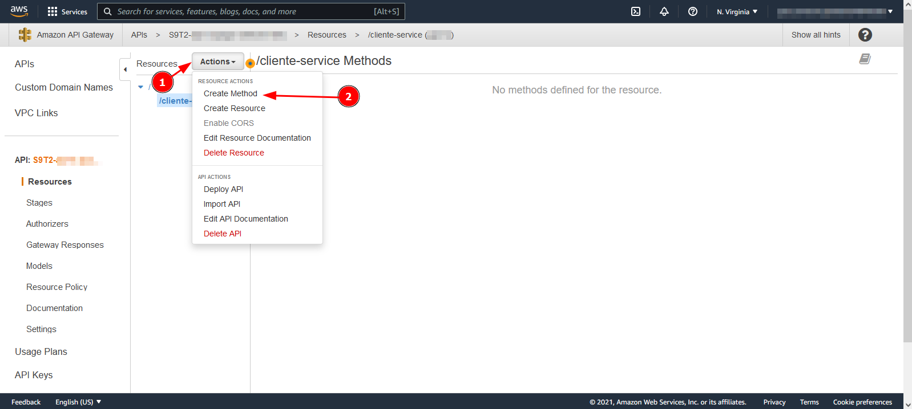

## Criando e implantando métodos na AWS Gateway

- <b> Criando, configurando e implantando métodos Gateway: </b>Siga os passos a passos indicados nas imagens após logar na sua conta na AWS.
    

    

    

    

    

    

    

    

    

    

